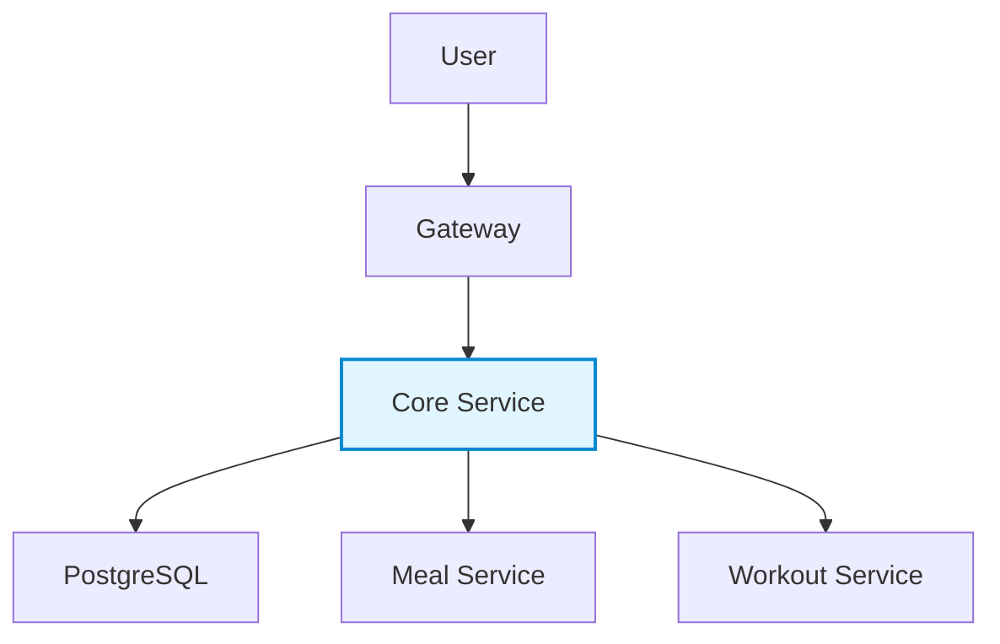

Core Service 🚀  
**Central User Management & Authentication System**

---

## 📋 Overview
**Core Service** — This is a central authentication and user management system, providing a single source of truth for user data across the entire platform.
The service manages user profiles, supports JWT authentication, and interacts with other microservices (nutrition, training, gateway, etc.).

---

## 🏗️ Architecture

---

## 🛠️ Technologies

|Stack|Description|
|---|---|
|**Spring Boot WebFlux**|Reactive web framework|
|**Spring Security**|Authentication & Authorization|
|**JWT**|Token-based security|
|**PostgreSQL**|Primary database|
|**common-lib**|Shared DTOs between services|

---

## 🔒 Security

- JWT token-based authentication
    
- Reactive `Spring Security` configuration
    
- Role-based access control
    
- Secure inter-service communication
    

---

## 🚀 Getting Started

### Prerequisites

- Java **21+**
    
- PostgreSQL **16+**
    
- Gradle

---
