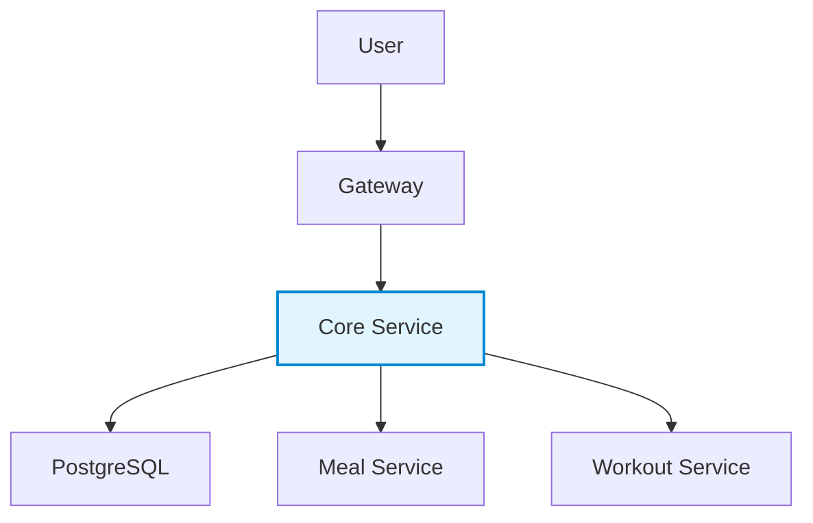

Core Service 🚀  
**Central User Management & Authentication System**

---

## 📋 Overview
**Core Service** — это центральная система аутентификации и управления пользователями, обеспечивающая единый источник достоверных данных о пользователях во всей платформе.  
Сервис управляет профилями пользователей, поддерживает авторизацию через JWT и взаимодействует с другими микросервисами (питание, тренировки, гейтвей и т.д.).

---

## 🏗️ Architecture

---

## 🛠️ Technologies

|Stack|Description|
|---|---|
|**Spring Boot WebFlux**|Reactive web framework|
|**Spring Security**|Authentication & Authorization|
|**JWT**|Token-based security|
|**PostgreSQL**|Primary database|
|**common-lib**|Shared DTOs between services|

---

## 🔒 Security

- JWT token-based authentication
    
- Reactive `Spring Security` configuration
    
- Role-based access control
    
- Secure inter-service communication
    

---

## 🚀 Getting Started

### Prerequisites

- Java **17+**
    
- PostgreSQL **12+**
    
- Maven or Gradle
    

### Run locally

`# Clone repository git clone https://github.com/your-org/core-service.git cd core-service  # Configure database in application.yml spring.datasource.url=jdbc:postgresql://localhost:5432/core_db spring.datasource.username=your_username spring.datasource.password=your_password  # Start application ./mvnw spring-boot:run`

---

## 📚 API Endpoints (examples)

|Method|Endpoint|Description|
|---|---|---|
|`POST`|`/api/auth/register`|Register new user|
|`POST`|`/api/auth/login`|Authenticate and get JWT|
|`GET`|`/api/users/profile`|Get user profile|
|`PUT`|`/api/users/goals`|Update user goals|

---

## 🧩 Future Improvements

- Add **OAuth2 / OpenID Connect** support
    
- Implement **audit logging**
    
- Integrate **Prometheus + Grafana** for metrics
    
- Add **Testcontainers** for integration testing
